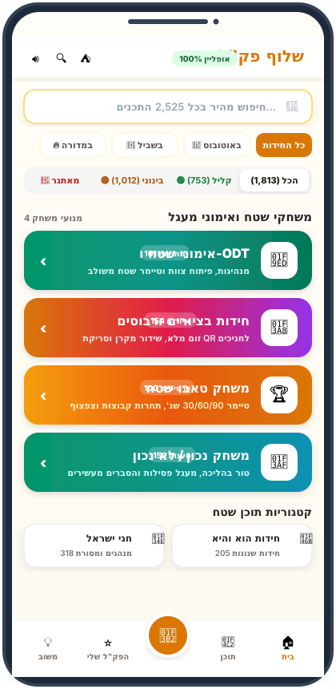
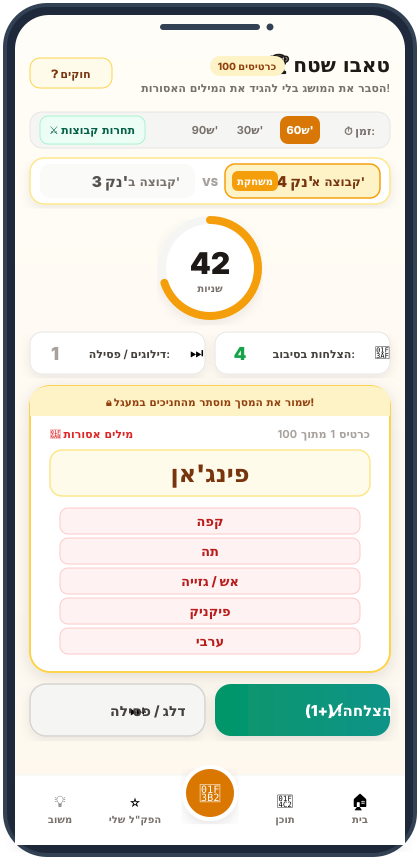
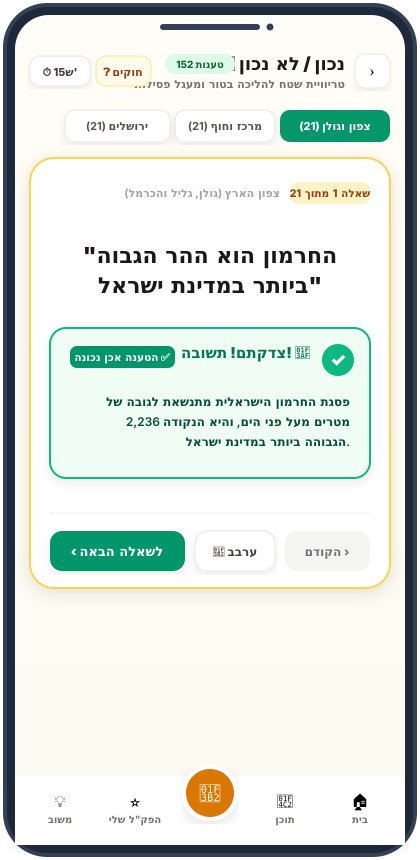
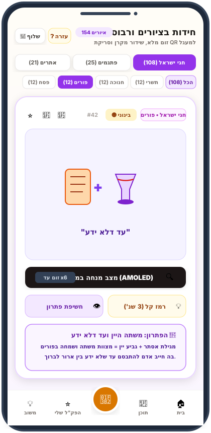
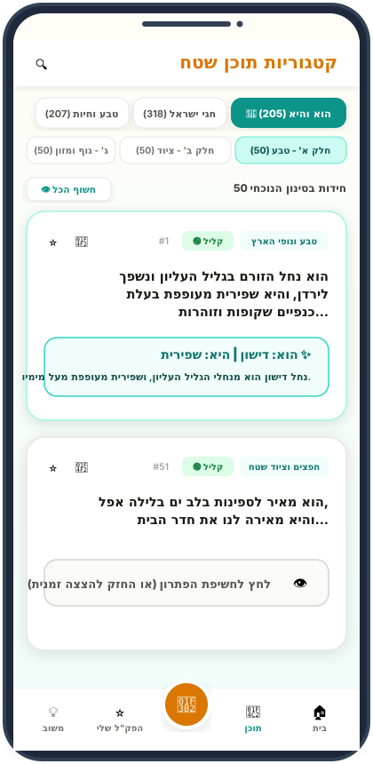
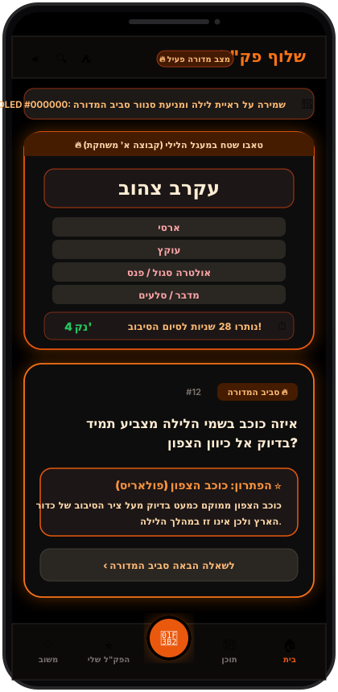
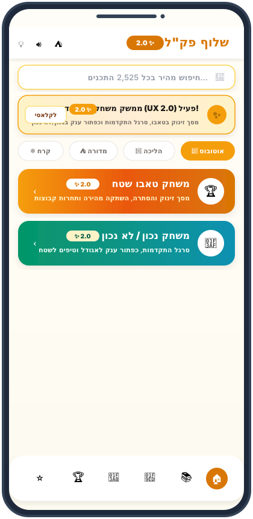
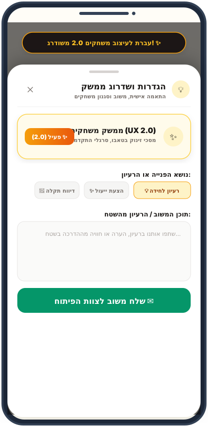
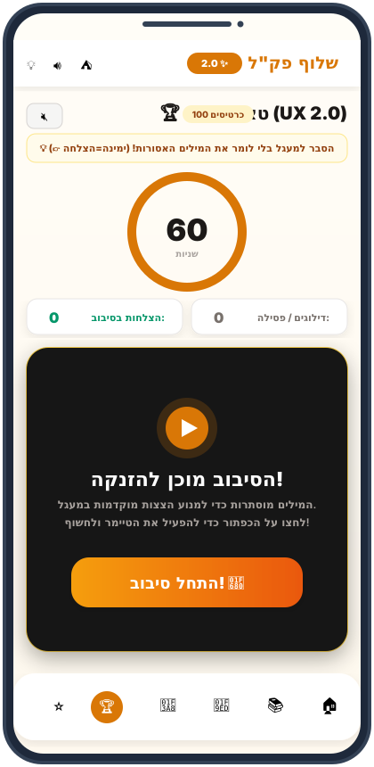
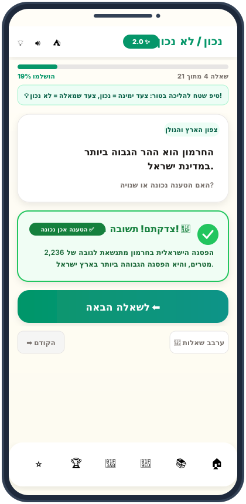

# שלוף (Shluf) - פק"ל חידות, ODT והפעלות שטח למדריכים

**פלטפורמת תוכן והפעלות שטח למדריכים – מותאמת מובייל (Mobile-First PWA & 100% Offline-First)**

[](https://github.com/NetanelNissim1/shluf-pakal)
[](https://shluf-pakal.org)
[](https://github.com/NetanelNissim1/shluf-pakal)
[](https://github.com/NetanelNissim1/shluf-pakal)
[](https://github.com/NetanelNissim1/shluf-pakal)
[](https://github.com/NetanelNissim1/shluf-pakal)
[](https://github.com/NetanelNissim1/shluf-pakal)
[](https://github.com/NetanelNissim1/shluf-pakal)
[](https://github.com/NetanelNissim1/shluf-pakal)
[](https://github.com/NetanelNissim1/shluf-pakal)
[](https://github.com/NetanelNissim1/shluf-pakal)
[](https://github.com/NetanelNissim1/shluf-pakal/actions)
[](https://github.com/NetanelNissim1/shluf-pakal)

---

## 🌟 סקירה כללית
אפליקציית **"שלוף"** פותחה במיוחד עבור מדריכי טיולים, מפקדים, מורים, תנועות נוער ומדריכי של"ח. האפליקציה מאפשרת שליפה מיידית (פחות מ-2 שניות) של מעל **2,525 חידות, משחק "נכון / לא נכון", משחק "הוא והיא", פעילויות ODT, חידות בציורים (רבוסים), משחק טאבו אינטראקטיבי מלא וסיפורים** ישירות מהסמארטפון – **ללא צורך בחיבור אינטרנט כלל (100% Offline-First)** ועם התאמה מרבית לתנאי שטח קיצוניים (שמש יוקדת או חושך סביב מדורה).

---

## 📱 גלריית מסכי האפליקציה (Visual UI Showcase)

> [!TIP]
> אפליקציית **שלוף פק"ל** מתוכננת בגישת **Mobile-First PWA**, עם פונטים מוגדלים, כפתורי מגע רחבים במיוחד לתפעול ביד אחת בשטח, וניגודיות צבעים אופטימלית לתנאי שמש ומדורה.

### 🏷️ תצוגת ממשק קלאסי (Classic Mode)

| מסך הבית ומרכז המשחקים 🏠 | משחק טאבו שטח קלאסי 🏆 |
| :---: | :---: |
|  |  |
| **דף הבית:** חיפוש מהיר, סינון לפי רגע בפעילות (אוטובוס, הליכה, מדורה), סינון קושי ו-4 מנועי המשחק. | **טאבו שטח קלאסי:** טיימר 30/60/90 שניות מונפש, תחרות קבוצות א' מול ב', וכרטיס מילים פתוח. |

| משחק נכון / לא נכון קלאסי 🎯 | חידות בציורים ורבוסים 🎨 |
| :---: | :---: |
|  |  |
| **נכון / לא נכון קלאסי:** 152 טענות שטח, כפתורי תשובה ומעבר באמצעות חיצים בסרגל התחתון. | **חידות בציורים:** 154 איורים וקטוריים מקומיים (SVG), סינון לפי 11 מועדי ישראל ורמז מהיר. |

| חידות "הוא והיא" למעגל 👫 | מצב מדורה לראיית לילה (AMOLED #000000) ⛺ |
| :---: | :---: |
|  |  |
| **הוא והיא:** 205 הגדרות שנונות המחולקות ל-4 חלקי שטח, כפתור חשיפה מיידי ושיתוף לוואטסאפ. | **מצב מדורה:** שחור אטום טהור `#000000` לחסכון בסוללה ושמירה על ראיית הלילה של החניכים. |

---

### ✨ תצוגת ממשק משודרג (UX 2.0 Mode) — מה השתנה בעיצוב החדש?

| דף הבית במצב 2.0 ✨ | מתג החלפה בהגדרות ובסרגל ⚙️ |
| :---: | :---: |
|  |  |
| **דף הבית 2.0:** באנר הכרזה עליון המודיע על מצב 2.0 עם כפתור חזרה מהיר לקלאסי, ותגיות `2.0 ✨` זוהרות על גבי כרטיסיות המשחקים. | **מתג החלפה אינטואיטיבי:** מעבר בלחיצה אחת בין מצב קלאסי ל-2.0 בסרגל העליון ובמגירת ההגדרות, בליווי רטט והודעת Toast קלילה. |

| טאבו שטח 2.0: מסך זינוק והסתרה 🚀 | נכון / לא נכון 2.0: סרגל וכפתור ענק 🎯 |
| :---: | :---: |
|  |  |
| **טאבו 2.0:** מסך הסתרה וזינוק (Curtain Overlay) אטום עם כפתור ענק "התחל סיבוב! 🚀" המונע הצצות במעגל, כפתור השתקה מהירה ומיקרו-טיפים. | **נכון / לא נכון 2.0:** סרגל התקדמות עליון מונפש (אחוזים ושאלה X מתוך Y), כפתור ענק נגיש לאגודל "לשאלה הבאה ⬅️", וטיפים מתחלפים להפעלה בשטח. |

---

## 🚀 תכונות עיקריות

1. **עבודה מלאה ללא קליטה (100% Offline PWA):**
   * כל 1,813 החידות, 205 הגדרות הוא והיא, ו-100 כרטיסי הטאבו מאוחסנים מקומית במכשיר.
   * Service Worker (Workbox) מבצע Pre-cache לכל הנכסים, הסקריפטים ומאגר הנתונים לעבודה במצב טיסה.
   * ניתן להתקנה ישירה על מסך הבית (Add to Home Screen) ב-iOS וב-Android כאפליקציית Standalone.

2. **עיצוב שטח כפול (Dual Field Mode):**
   * **מצב שמש ישירה (High Contrast Outdoor Mode):** רקע צהוב-מדברי עדין/לבן, טקסט כהה בניגודיות מקסימלית ופונטים גדולים (`19px+`) לקריאה קלה בהליכה בשמש.
   * **מצב מדורה (Amoled Campfire Night Mode):** רקע שחור עמוק (`#000000`) עם גווני אש וכתום-אמבר לשמירה על ראיית לילה ומניעת סנוור החניכים.

3. **מערכת סינון רמות קושי (Difficulty Level Filtering):**
   * כל שאלה במאגר מסווגת לאחת משלוש רמות:
     * 🟢 **קליל (753 חידות):** שאלות זיהוי מהירות, מנהגים בסיסיים, אותיות וחיות (מתאים לילדים ולחימום).
     * 🟡 **בינוני (1,012 חידות):** שאלות ידע כללי, טבע, שירים, היסטוריה ומושגי שטח מאוזנים.
     * 🔴 **מאתגר (253 חידות):** חידות היגיון מתחכמות, כפל משמעות, פלינדרומים ושאלות עומק.
   * תגית חיווי צבעונית מוצגת על גבי כל כרטיסיית חידה.
   * רכיב סינון קושי מהיר זמין הן במסך הבית והן במסך הקטגוריות לשילוב סינון עם כל נושא וחג.

4. **מנגנון הגנה נגד הצצות (Anti-Peeking Mechanism):**
   * הפתרונות מוסתרים כברירת מחדל בכרטיסייה אטומה.
   * **Tap to Reveal:** לחיצה לחשיפת הפתרון.
   * **Press & Hold:** לחיצה ממושכת להצצה זמנית בפתרון (נעלמת מיד עם עזיבת האצבע).
   * כפתור מהיר "חשוף הכל" / "הסתר הכל" בראש כל רשימה.

5. **כפתור הפלא: "שלוף לי!" (The Randomizer FAB):**
   * כפתור צף קבוע בתחתית המסך (אזור האגודל - Thumb Zone).
   * שליפה אקראית עם אפקט רולטה, רטט שטח (`navigator.vibrate`) ואפקט קונפטי.
   * סינון שליפה מכלל המאגר או מקטגוריה מוגדרת.

6. **משחק טאבו שטח אינטראקטיבי (100 כרטיסים מלאים):**
   * חפיסת 100 כרטיסי טאבו שטח עשירה ללא כפילויות.
   * תצוגה מוגדלת לקריאה ממרחק מול הקבוצה.
   * **טיימר 30 / 60 / 90 שניות** מונפש עם תקתוקי אזהרה וצפצוף סיום (מסונתז ישירות ב-Web Audio API – ללא קבצים חיצוניים).
   * החלקה ימינה/שמאלה (Swipe) להחלפת כרטיס, תחרות קבוצות א' מול ב', מסך סיכום סיבוב ומודאל הוראות מובנה.

7. **הפק"ל שלי (Personal Pakal):**
   * שמירת שאלות נבחרות לטיול הספציפי בלחיצה על סמל הכוכב (★) בכל חידה.
   * עבודה ואחסון מלאים ב-LocalStorage ללא תלות ברשת.
   * **כפתור "שלח לוואטסאפ" (📲):** מייצר הודעה מעוצבת ומוכנה לשליחה לצוות ההדרכה.

8. **בקרת שמע שטח (Speaker / Mute Toggle):**
   * כפתור רמקול בראש המסך מאפשר השתקה או הפעלה מהירה של כל צלילי האפליקציה (טיימר, הצלחה, רולטה) בהתאם לתנאי הפעילות.

9. **אבטחת מידע והגנה מפני גניבת תוכן (Security & Anti-Scraping):**
   * **הצפנת נתונים (UTF-8 Byte XOR Cipher):** כלל מאגרי המידע אינם חשופים כטקסט פתוח ב-Network Tab או ב-Bundle, אלא מוצפנים ב-Build ונפרקים רק לזיכרון ה-RAM בזמן ריצה.
   * **חסימת העתקה וסימון:** מניעת סימון טקסט (`user-select: none`), חסימת Drag & Drop.
   * **חסימת קליק ימני וקיצורים:** מניעת Context Menu וחסימת קיצורי פיתוח (`F12`, `Ctrl+U`, `Ctrl+S`, `Ctrl+Shift+I`).
   * **מדיניות Content Security Policy (CSP):** כותרות אבטחה מחמירות המונעות הזרקות XSS ו-Clickjacking.
   * **סניטיזציה:** ניקוי שאילתות חיפוש והגבלת אורך למניעת ReDoS.

10. **מודול פעילויות שטח ואימוני ODT (101 מתודות שטח):**
    * **101 פעילויות שטח מלאות** מחולקות ל-10 קטגוריות מתודולוגיות (חימום, מנהיגות, גיבוש, אמון, אסטרטגיה, קונפליקטים, אי-ודאות, תקשורת, סיכום, ושדה קיצון).
    * **טיימר אינטגרלי מובנה בכרטיסייה:** כולל שעון עצר לספירת זמן המשימה וטיימר ספירה לאחור מוגדר מראש לפי משך הפעילות, צלילי תקתוק שטח ב-Web Audio API ורטט סיום.
    * **סינוני שטח מהירים:** לפי ציוד (ללא ציוד, חבלים, מים, כיסויי עיניים, סנדות/קרשים), משך זמן וסביבה (שביל, מחנה, מים, לילה, שטח פתוח).
    * **מודאל הדרכת ODT מובנה** לשמירה על מתודולוגיה נכונה ורצף פעילויות.

11. **מודול חידות בציורים ורבוסים גרפיים (154 חידות ויזואליות):**
    * **154 איורים וקטוריים ברזולוציה גבוהה (SVG מקומי):** 100% Offline-First ללא תלות ברשת (חגי ומועדי ישראל [108], פתגמים וביטויים [25], ואתרי ארץ ישראל [21]).
    * **כיווניות עברית טבעית (RTL מימין לשמאל):** כל 154 חידות הציורים והרבוסים מסודרים בסדר קריאה עברי טבעי – האיבר הראשון ממוקם בצד ימין והאיבר האחרון בצד שמאל (ללא שום רמזים או חיצים מלאכותיים), בהתאמה מושלמת למבנה המשפטים והפתגמים בעברית.
    * **עיצוב נקי ומוגן מספוילרים (Anti-Spoiler by Design):** כרטיסיות החידה מציגות את האיור הווקטורי הנקי בלבד ללא שום משפט או כותרת חושפת מעל התמונה. הפתרון וההסבר מוצגים אך ורק בלחיצה יזומה על "לחץ לחשיפת הפתרון" (או החזקה להצצה).
    * **מצב מנחה במסך מלא (Presenter Full-Screen AMOLED #000000):** רקע שחור אטום לחיסכון בסוללה ומניעת סנוור, כותרת עליונה נקייה ללא ספוילר, וכפתור ייעודי **"לחץ לחשיפת הפתרון"** החושף את הפתרון המלא לפי דרישה בלבד, עם מחוות צביטה וגרירה (Pinch-to-Zoom & Pan) להגדלה עד פי 6.
    * **ארכיטקטורת הגנה נגד הצצות:** רמז זמני מוגבל ל-4 שניות, תגיות alt ניטרליות המונעות חשיפת תשובות בקוראי מסך ובריחוף, ומצב מקרן / מסך כפול (Dual Display) המקרין תמונה נקייה בלבד ללא שום טקסט.
    * **שיתוף מעגל ב-QR מקומי ללא אינטרנט ושיתוף מוגן לוואטסאפ ללא פתרונות.**

12. **קטגוריית חידות "הוא והיא" (205 הגדרות לשון ושנינה אותנטיות):**
    * **205 הגדרות שנונות ומאומתות** בעברית תקנית ועשירה (0 מילים מומצאות, 0 טריוויאליות), מחולקות ל-4 חלקי שטח: טבע ונופי הארץ (50), חפצים וציוד שטח (50), גוף ומזון (50), ולשון, חברה והווי ישראלי (55).
    * **תצוגת כרטיסיות שטח אינטגרלית וזורמת:** שילוב ישיר ונקי בתוך מסך "קטגוריות תוכן שטח" ללא חלונות קופצים או מודאלים מעיקים.
    * **חשיפה מהירה ושליטה מלאה:** כפתור יחיד לחשיפה מיידית של הפתרון ("הוא: X | היא: Y"), סינון לפי רמות קושי (קליל, בינוני, מאתגר), חיפוש חופשי, שמירה לפק"ל האישי ושיתוף מהיר לוואטסאפ של המדריכים.

13. **משחק "נכון / לא נכון" לשטח (152 טענות טריוויה, אזורים ומועדים - חדש!):**
    * **152 טענות שטח מסווגות ומאומתות** להפעלה מהירה ללא שום ציוד:
      * **4 חבלי ארץ (84 טענות):** צפון הארץ והגולן (21), מישור החוף והמרכז (21), ירושלים והרי יהודה (21), הדרום, הנגב והערבה (21).
      * **4 מועדי ישראל (68 טענות):** חגי תשרי (17), חנוכה וט"ו בשבט (17), פורים ופסח (17), עצמאות, ל"ג בעומר ושבועות (17).
    * **3 סגנונות הפעלה מובנים לשטח:** טור בהליכה (ימין=נכון, שמאל=לא נכון), מעגל פסילות בעצירת צל (ידיים על הראש / מותניים), וגרסת הבלוף והסודות המחכימים.
    * **ארגז כלים אינטגרלי למדריך:** טיימר שטח (15 שניות), לוח ניקוד קבוצות (א' מול ב'), כפתור ערבוב (Shuffle), והסבר לימודי מפורט לכל טענה.
    * **משוב ויזואלי אדפטיבי ומעודד (Adaptive Feedback):** חיווי ירוק חגיגי ומעצים (`CheckCircle2` ומסגרת ירוקה) בכל פעם שהמשתתפים עונים נכון – הן כאשר הטענה נכונה והן כאשר זיהו בהצלחה שהטענה אינה נכונה (למניעת דיסוננס קוגניטיבי), לעומת חיווי שגיאה אדום במקרה של טעות, ותצוגה נייטרלית מעודנת בחשיפת מדריך ללא ניחוש.

14. **מערכת משוב מוגנת, זיהוי מסך מדויק והגנה מפני הצפות דואר (Anti-Spam & Client Telemetry):**
    * **מנגנון Rate Limiting מקומי מבוסס זמן:** הגבלה מחמירה ב-LocalStorage ל-3 פניות בלבד בחלון זמן של 15 דקות למניעת הצפת תיבה.
    * **מלכודת בוטים בלתי-נראית (Honeypot):** לכידה וחסימה מוקדמת של בוטים וסורקים אוטומטיים (`botcheck`).
    * **זיהוי מסך ומשחק מדויק בזמן אמת:** זיהוי מלא ומדויק של המסך או המשחק הפעיל (משחק טאבו שטח, משחק נכון/לא נכון, חידות בציורים, ODT, קטגוריית תוכן ספציפית או דף הבית) המועבר ישירות בגוף המייל לשיוך מיידי של ההערה לתוכן הרלוונטי.
    * **זיהוי סוג מכשיר וסביבה (Device Info):** זיהוי ידידותי של פלטפורמת המשתמש (סמארטפון iPhone/Android או מחשב שולחני Windows/Mac/Linux + סוג דפדפן).
    * **מזהה מכשיר אנונימי וקבוע (Client ID):** מזהה לקוח ייחודי (`cl_xxxxxx`) הנשמר מקומית בדפדפן ומאפשר למנהל המערכת לזהות ריבוי פניות חריג מאותו מכשיר ולחסום אותו בעת הצורך.

15. **מנוע עיצוב כפול – מצב קלאסי מול ממשק משודרג (Settings Toggle - חדש!):**
    * **מתג בחירה אינטואיטיבי (Option B):** מתג החלפה מהיר בסרגל העליון (Header עם אייקון ניצוצות `✨`) ובמגירת ההגדרות והמשוב (Feedback Drawer) המאפשר למשתמש לבחור בחופשיות בין **עיצוב קלאסי (Classic)** לבין **עיצוב משודרג**.
    * **עיצוב משחקים נקי:** כל המשחקים נקיים לחלוטין מכל תגיות גרסה או כיתובים מלאכותיים, והמעבר בין הממשקים מתבצע באופן אלגנטי דרך מתג ההחלפה במסך.
    * **שמירה מקומית קבועה (Persistence):** העדפת המשתמש נשמרת ב-LocalStorage באמצעות Zustand ונטענת אוטומטית בכל כניסה.
    * **תאימות מלאה לאחור (100% Backward Compatibility):** במצב קלאסי כל המשחקים והמסכים נשמרים במבנה המקורי והמוכר ללא שינוי.
    * **שדרוגי חוויית משתמש במצב המשודרג:**
      * **טאבו שטח:** מסך הסתרה וזינוק (Curtain Overlay) המונע הצצות לפני תחילת הסיבוב, כפתור השתקת צלילים מהירה בטיימר, מיקרו-טיפים להפעלה, ותמיכה בקיצורי מקלדת (Space, Enter, Backspace) להקרנה על מסך.
      * **נכון / לא נכון:** סרגל התקדמות עליון מונפש, טיפים דינמיים להפעלת הקבוצה במעגל או בהליכה בטור, כפתור ענק ונגיש לאגודל "לשאלה הבאה ⬅️", וקיצורי מקלדת (1/T, 2/F, Space).
      * **חידות בציורים:** כפתור הזנקה מהיר "הפעל במעגל ▶️" לפתיחת מצב מצגת ישיר.
      * **הוא והיא:** באנר הדרכה מזמין וקריא המסביר כיצד להנחות את המשחק במעגל.
      * **שליפה אקראית רב-משחקית:** מודאל הרנדומייזר מציג חיווי מותאם לשליפת חידות והפעלות.
      * **סיור קליטה אדפטיבי (Adaptive Onboarding Tour):** סיור המודרך מתאים את עצמו למצב הנבחר ומדריך על כל מנועי המשחק החדשים.

16. **צינור אינטגרציה רציפה ב-GitHub Actions (Continuous Integration & Quality Pipeline - חדש!):**
    * **אוטומציה מלאה בענן:** בכל פעולת `git push` או פתיחת Pull Request, מופעל Workflow ייעודי ב-GitHub Actions המאמת את הקוד על גבי שרתי Linux (Ubuntu).
    * **בדיקות מקיפות ואבטחה:** הרצה אוטומטית של כלל **203 מחזורי הבדיקות** (שלמות תוכן, הצפנת נתונים ב-Byte Cipher, הגנה מספוילרים, ארגונומיית מובייל ו-Safe Areas).
    * **בניית Production ובקרת איכות:** אימות קומפילציה קפדנית ב-TypeScript (`tsc`) ובניית חבילת ה-PWA ב-Vite, המבטיחים ששום שינוי שבור לא יגיע לסביבת הייצור (Zero-Downtime Guarantee).

---

## 📂 10 קובצי התוכן והמאגרים של הפרויקט

התוכן נשאב ומפורסר ישירות מ-10 קובצי Markdown עשירים בתיקיית `content/`:

| קובץ תוכן | נושא הקטגוריה | כמות פריטים | דגשים ונושאים |
| :--- | :--- | :---: | :--- |
| [`word_chains_riddles.md`](file:///c:/projects/shluf-pakal/content/word_chains_riddles.md) | **שרשראות מילים ותחיליות** | **349** | חידות אותיות, חידות "פיל", "חל", "גל", "מס", "פר", "חן", "עץ". |
| [`nature_and_animals.md`](file:///c:/projects/shluf-pakal/content/nature_and_animals.md) | **טבע, בעלי חיים וצומח** | **207** | חיות לפי א'-ב', חרוזים ותיאורים, הוא והיא בצמחים, בוטניקה ופירות. |
| [`israel_history_places.md`](file:///c:/projects/shluf-pakal/content/israel_history_places.md) | **ארץ ישראל, היסטוריה וערים** | **290** | חידות חוצה ישראל, אתרים היסטוריים, ערים ויישובים, וכן **80 שאלות שטח והדרכה ב-10 חבלי ארץ (ירושלים, מדבר יהודה, גולן, גליל, נגב, שפלה, שרון וכרמל, עמק המעיינות, שומרון, ואילת)**. |
| [`language_and_logic.md`](file:///c:/projects/shluf-pakal/content/language_and_logic.md) | **לשון, היגיון וכפל משמעות** | **435** | חידודי לשון, כפל משמעות, חידות "למה? כי...", צירופים והיפוכיהם, פלינדרומים. |
| [`culture_and_songs.md`](file:///c:/projects/shluf-pakal/content/culture_and_songs.md) | **תרבות, שירים ישראליים וטאבו** | **214** | שירים ישראליים, חידות מפורסמים, רגע של אנגלית ותרגום מצחיק, 100 כרטיסי טאבו. |
| [`jewish_holidays.md`](file:///c:/projects/shluf-pakal/content/jewish_holidays.md) | **חגי ומועדי ישראל** | **318** | **חידות מנהגים ומסורת לכל מועדי השנה עם סינון לפי כל חג:**<br>• ראש השנה (32)<br>• יום הכיפורים (31)<br>• סוכות ושמחת תורה (32)<br>• חנוכה (32)<br>• ט"ו בשבט (31)<br>• פורים (33)<br>• פסח (35)<br>• יום הזיכרון ויום העצמאות (31)<br>• ל"ג בעומר (30)<br>• שבועות (31) |
| [`true_or_false_israel_trips.md`](file:///c:/projects/shluf-pakal/content/true_or_false_israel_trips.md) | **משחק נכון / לא נכון (חדש!)** | **152** | **152 טענות טריוויה לשטח:**<br>• צפון, מרכז, ירושלים ודרום (84)<br>• חגי תשרי, חנוכה, פורים-פסח, עצמאות ושבועות (68)<br>ממשק שטח אינטראקטיבי, טיימר, ניקוד קבוצות והסברים מעשירים. |
| [`odt_games_activities.md`](file:///c:/projects/shluf-pakal/content/odt_games_activities.md) | **פעילויות שטח ואימוני ODT** | **101** | **101 מתודות שטח מובנות** למנהיגות, גיבוש, תקשורת ואמון, כולל טיימר מובנה וסינוני ציוד. |
| [`visual_riddles_database.md`](file:///c:/projects/shluf-pakal/content/visual_riddles_database.md) | **חידות בציורים ורבוסים** | **154** | **154 איורי SVG וקטוריים מקומיים** לחגים (108), ביטויים (25) ואתרי הארץ (21), ממשק מוגן מספוילרים, מצב מנחה במסך מלא, חשיפת פתרון מוגנת, מסך כפול וקוד QR. |
| [`he_and_she_riddles.md`](file:///c:/projects/shluf-pakal/content/he_and_she_riddles.md) | **חידות "הוא והיא"** | **205** | **משחק לשון ושנינה שנון למעגל:**<br>• טבע ונופי הארץ (50)<br>• חפצים וציוד שטח (50)<br>• גוף ומזון (50)<br>• לשון והווי ישראלי (55)<br>משולב ישירות בתוך קטגוריות השטח עם כרטיסיות זורמות וחשיפה מיידית. |


---

## 🛠️ פקודות הרצה ופיתוח

```bash
# 1. התקנת תלויות
npm install

# 2. הרצת שרת פיתוח מקומי (כולל חשיפה ל-Wi-Fi מקומי לטלפון)
npm run dev

# 3. פרסור והצפנת קובצי התוכן (במידה ונוספו חידות או פעילויות ל-content/)
npm run parse

# 4. הרצת מחזורי הבדיקות האוטומטיים (206 בדיקות אימות, מנוע UX 2.0, תאימות סמארטפונים iPhone/Android, CI, אבטחה ו-Offline ב-34 מחזורים)
npm run test

# 5. בניית גרסת Production מוצפנת ו-PWA מלאה
npm run build

# 6. בדיקת גרסת ה-Production המקומית
npm run preview
```

---

## 🚀 פריסה והפצה בחינם (Deployment to Vercel)

הפרויקט מותאם לפריסה מיידית ב-**Vercel**:
1. היכנסו ל-[vercel.com](https://vercel.com/) והתחברו לחשבון ה-GitHub.
2. בחרו לייבא את המאגר: `NetanelNissim1/shluf-pakal`.
3. Vercel מזהה אוטומטית פרויקט **Vite** ומגדיר את פקודת הבנייה `npm run build` ואת תיקיית הפלט `dist`.
4. לחצו **Deploy** – תוך שניות האתר באוויר עם תעודת SSL, ביצועי Edge CDN ועדכונים אוטומטיים בכל `git push`.
