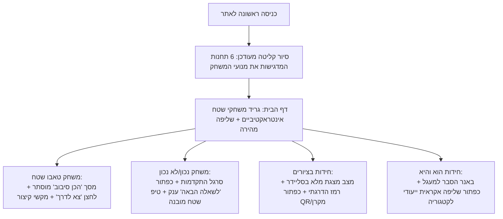

# 🎮 תוכנית אב: שדרוג חוויית השימוש (UX), נגישות ובהירות ההפעלה של כל משחקי האתר וסיור הקליטה

---

## 🧭 1. סקירת המצב הקיים והשוואה למשחקי רשת ומובייל פופולריים

בחינה מעמיקה של האתר מול משחקי רשת מובילים בעולם (**Heads Up!**, **Kahoot**, **Taboo Online**, **Wordle**, **Trivia Crack**) מעלה תובנות קריטיות:
1. **משחקי שטח וסמארטפון דורשים "אפס חיכוך":** מדריך בשטח מחזיק את הטלפון ביד אחת, לעיתים בשמש מסנוורת, תוך כדי הליכה או במעגל ישיבה. הכפתורים חייבים להיות ענקיים, זרימת המשחק צריכה להיות ברורה באופן מיידי, ללא צורך לקרוא הוראות ארוכות.
2. **סיור הקליטה הנוכחי (`OnboardingTour.tsx`) מפספס את העיקר:** כיום הסיור מציג 6 תחנות כלליות (כפתור צף, פונט, מצב מדורה, משוב, סינונים, פק"ל אישי), אך **אינו מציג כלל את 4 משחקי הדגל האינטראקטיביים של האתר** (טאבו שטח, נכון/לא נכון, חידות בציורים, ואימוני ODT). משתמש חדש עלול לחשוב שמדובר במאגר טקסט רגיל!
3. **היעדר מצב "התחלת סיבוב" (Ready-Set-Go) בטאבו:** כיום הכרטיס גלוי מיד והטיימר מושהה, דבר שמקשה על מניעת הצצות טרם תחילת הזמן.
4. **חוסר בסרגל התקדמות וכפתור "הבא" מודגש בטריוויה:** במשחק "נכון / לא נכון", לאחר מענה אין כפתור ראשי ענק להמשך ישיר, אלא צריך לחפש את החץ הקטן בסרגל הכלים התחתון.

---

## 📊 תרשים זרימת חוויית המשתמש החדשה (High-Level UX Architecture)

---

## 🕹️ 2. פירוט השדרוגים המוצעים לכל משחק באתר

### משחק 1: טאבו שטח (`TabooGame.tsx`)
* **בהשראת: *Heads Up!* ו-*Taboo Online***
* **מצב "מסך הסתרה לפני תחילת סיבוב" (Stealth Round Curtain):**
  * כשהטיימר עומד על 60 שניות וטרם הופעל, מילת המטרה והמילים האסורות מכוסות במסך מעוצב עם כפתור גדול: **"התחל סיבוב! 🚀"**.
  * ברגע הלחיצה – הטיימר מתחיל, הכרטיס נחשף מיד, ונשמע צפצוף זינוק ("צא לדרך!").
  * מונע הצצה של חברי המעגל לפני שהמסביר מוכן.
* **הוספת מקשי קיצור למחשב/מקרן (Desktop & Projector Hotkeys):**
  * `רווח` (Space): התחל / השהה טיימר.
  * `חץ ימינה` או `Enter`: הצלחה (+1).
  * `חץ שמאלה` או `Backspace`: דילוג / פסילה.
* **כפתור השתקת צלילים מהירה בראש המשחק (Quick Mute):**
  * כפתור רמקול ייעודי ישירות בכותרת המשחק, המאפשר השתקה מיידית (למשל באזורים שקטים כמו אתרי זיכרון או שמורות טבע).
* **שורת טיפ קבועה (Micro-Hint):**
  * שורה קצרה וקבועה מעל הכרטיס: *"הסבר למעגל בלי לומר את המילים האסורות. החלק ימינה להצלחה 👉 או שמאלה לדילוג 👈"*.

---

### משחק 2: נכון / לא נכון (`TrueFalsePage.tsx`)
* **בהשראת: *Kahoot!* ו-*Trivia Crack***
* **סרגל התקדמות ויזואלי (Progress Bar):**
  * הוספת סרגל התקדמות עליון דק ומעוצב (`h-2 rounded-full bg-emerald-500`) שמראה חזותית את ההתקדמות בתוך האזור או המועד הנבחר (למשל: שאלה 4 מתוך 21).
* **כפתור "השאלה הבאה ⬅️" בולט וראשי לאחר חשיפת התשובה:**
  * כיום, לאחר בחירת תשובה נחשף ההסבר, אך המדריך נדרש ללחוץ על חץ קטן בסרגל הכלים התחתון.
  * נציג כפתור ירוק ענק ונגיש לאגודל ישירות מתחת לקופסת ההסבר: **"לשאלה הבאה ⬅️"**, המאפשר מעבר מיידי ואינטואיטיבי תוך כדי תנועה.
* **תגית סגנון הפעלה שטח (Field Play Style Hint):**
  * תגית קטנה ומתחלפת המציגה למדריך רמז הפעלה:
    * *"טיפ שטח להליכה בטור: צעד ימינה = נכון, צעד שמאלה = לא נכון!"*
    * *"טיפ למעגל: ידיים על הראש = נכון, ידיים על המותניים = לא נכון!"*
* **מקשי קיצור למחשב:**
  * מקש `1` או `T`: בחירת "נכון".
  * מקש `2` או `F`: בחירת "לא נכון".
  * מקש `רווח` או `Enter`: מעבר לשאלה הבאה.

---

### משחק 3: חידות בציורים ורבוסים (`VisualRiddlesPage.tsx`, `PresenterModal.tsx`)
* **בהשראת: *4 Pics 1 Word* ומשחקי רבוס מובילים**
* **כפתור "התחל רצף חידות במעגל" (Play / Carousel Mode):**
  * כיום הדף מציג רשימת גלילה ארוכה של 154 כרטיסים.
  * נוסיף בראש העמוד כפתור בולט: **"הפעלת חידות במעגל (מסך מלא) ▶️"**.
  * לחיצה עליו פותחת ישירות את מצב המנחה במסך מלא עם חצי דפדוף ימינה/שמאלה גדולים, המאפשרים להעביר חידות בשידור חי מול החניכים.
* **רמז מדורג (Progressive Hint):**
  * שלב 1: חשיפת הנושא וההקשר.
  * שלב 2: חשיפת האות הראשונה של הפתרון.
  * שלב 3: חשיפה כפולה מלאה של הפתרון.

---

### משחק 4: חידות "הוא והיא" (`CategoryPage.tsx`)
* **בהשראת: משחקי לשון וחידות מעגל**
* **באנר הדרכה ייעודי למשחק:**
  * בכניסה לקטגוריית "הוא והיא", נוסיף כרטיס פתיחה צבעוני ומזמין:
    *"משחק הוא והיא למעגל: רמז להוא ורמז להיא – מצאו את צמד המילים בעלות אותו צליל! (לדוגמה: הוא מאיר בים = מגדלור, היא מאירה בבית = מנורה)"*.
* **כפתור שליפה אקראית מהירה מתוך "הוא והיא":**
  * כפתור קבוע בראש הקטגוריה: **"שלוף חידת הוא והיא אקראית 🎲"** – מקפיץ ישירות חידה אחת מתוך 205 ההגדרות למעגל, מבלי לגלול ברשימה.

---

### משחק 5: שליפה אקראית רב-משחקית ("שלוף לי!" - `RandomizerModal.tsx`)
* **המצב הקיים:** כפתור ה-FAB המרכזי שולף כיום **אך ורק חידות טקסט**. הוא מתעלם מ-100 כרטיסי טאבו, 152 שאלות נכון/לא נכון, ו-154 חידות בציורים!
* **השדרוג המוצע:**
  * מתג בחירה מהיר בראש הרולטה:
    * 🎲 **כל המאגרים המשולבים** (חידות + טאבו + נכון/לא נכון + ציורים).
    * 🃏 **שלוף טאבו שטח**.
    * ❓ **שלוף נכון / לא נכון**.
    * 🎨 **שלוף חידה בציור**.
    * 💡 **שלוף חידת טקסט**.

---

## 🌟 3. סידור מחדש של סיור הקליטה וה-Tooltips (`OnboardingTour.tsx`)

סיור הקליטה יעודכן ל-6 תחנות ממוקדות שמציגות את **מנועי המשחק המובילים**:

| תחנה | יעד המיקוד במסך | כותרת ואייקון | תוכן ההסבר החדש |
| :---: | :--- | :--- | :--- |
| **1** | באנר משחקי השטח (טאבו ונכון/לא נכון) | **משחקי שטח ותחרויות קבוצתיות 🏆** | "טאבו שטח עם טיימר וצפצופים, משחק נכון/לא נכון להליכה בטור, וחידות בציורים. הכל מובנה ומוכן להפעלה מיידית במעגל ללא שום ציוד!" |
| **2** | כרטיסיית חידות בציורים ואימוני ODT | **חידות בציורים ואימוני ODT 🎨** | "154 חידות ויזואליות עם זום ומצב מקרן, ו-101 מתודות שטח לפיתוח מנהיגות וגיבוש עם טיימר משימות משולב." |
| **3** | כפתור צף מרכזי (FAB) | **שליפה מהירה למעגל 🎲** | "לחיצה אחת שולפת רולטת תוכן אקראית לשבירת שגרה או עצירת קפה בשביל. פועל 100% אופליין גם במעמקי נחל ללא קליטה!" |
| **4** | צ'יפים של רגעי פעילות | **חידות מותאמות לרגע 🧭** | "סינון מהיר לפי הסיטואציה בשטח: נסיעה באוטובוס, הליכה בשביל, סביב המדורה, או משחקי שבירת קרח." |
| **5** | הפק"ל האישי (סמל כוכב) | **הפק"ל האישי שלך למסלול ⭐** | "סמנו כל חידה או משחק בכוכב כדי להרכיב מערך הדרכה אישי מראש. בלחיצה אחת תוכלו לשתף את כל המערך לוואטסאפ של המדריכים." |
| **6** | סרגל עליון (פונט ומצב מדורה) | **התאמה מלאה לתנאי שטח ⛺🔍** | "השמש מסנוורת? הגדילו את הטקסט בלחיצה. פעילות לילה? עברו ל'מצב מדורה' שאינו פוגע בראיית הלילה של החניכים." |

---

## 📋 4. שלבי הביצוע המוצעים (Execution Phases)

1. **שלב א': שדרוג ממשק משחק טאבו שטח**
   * הוספת מסך הסתרה מקדים (Curtain) עם לחצן "התחל סיבוב 🚀".
   * הוספת מקשי קיצור מקלדת (Space, Enter, Arrows).
   * הוספת כפתור השתקה ישיר בראש המשחק.
2. **שלב ב': שדרוג ממשק משחק נכון / לא נכון**
   * הוספת סרגל התקדמות עליון.
   * הוספת כפתור ראשי ענק "לשאלה הבאה ⬅️" לאחר חשיפת הפתרון.
   * הוספת באנר טיפ הפעלה שטח מתחלף.
3. **שלב ג': שדרוג חידות בציורים, "הוא והיא", והרולטה**
   * כפתור הפעלת מצגת במעגל במסך מלא.
   * כרטיס הדרכה ושליפה מהירה ב"הוא והיא".
   * תמיכה בשליפת טאבו, נכון/לא נכון וציורים ב-Randomizer.
4. **שלב ד': שדרוג סיור הקליטה וה-Tooltips (`OnboardingTour.tsx`)**
   * עדכון 6 התחנות הממוקדות והסלקטורים התואמים בדף הבית.
5. **שלב ה': בדיקות מקיפות ועדכון ה-README**
   * הוספת מחזור בדיקות 32 ב-[`scripts/verify-app.cjs`](file:///c:/projects/shluf-pakal/scripts/verify-app.cjs).
   * הרצת בדיקות אבטחה ולוודא 100% הצלחה.
   * הרצת `npm run build` ובדיקת PWA נקייה.
   * עדכון מסמך ה-[`README.md`](file:///c:/projects/shluf-pakal/README.md) עם הפיצ'רים החדשים.
